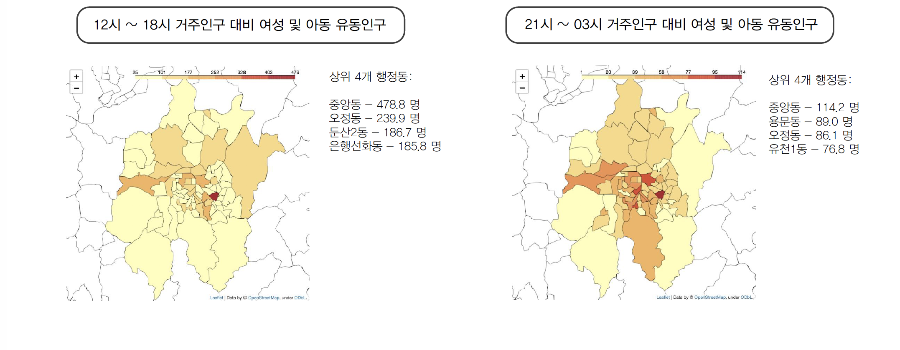
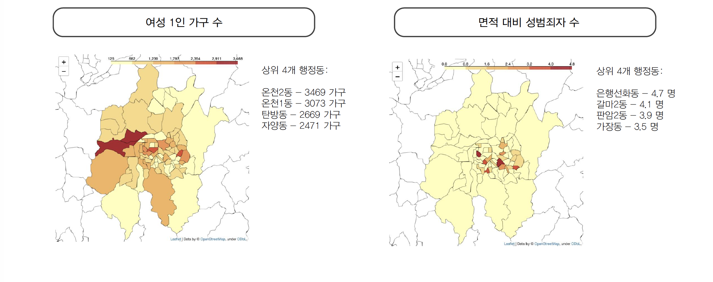
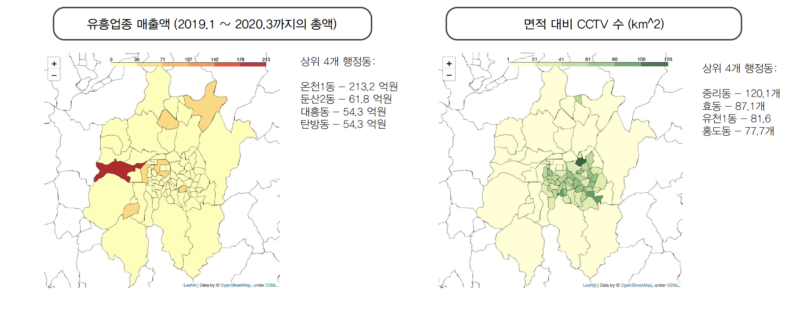
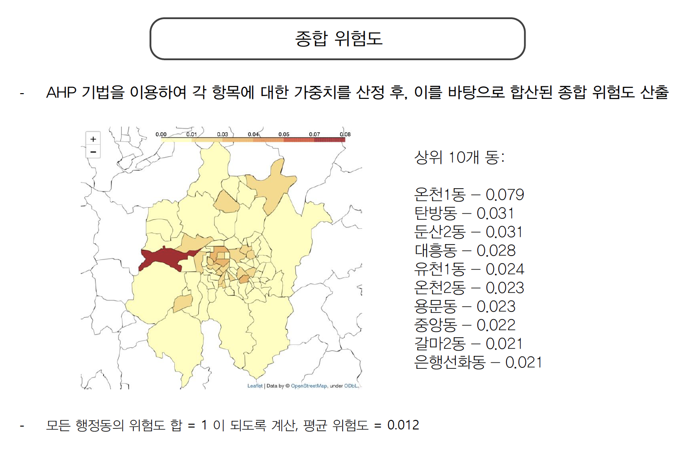

# 대전시 2020 빅데이터 공모전
"대전시 2020 빅데이터 분석 및 아이디어 공모전"에 참가하며 진행한 프로젝트 입니다.

본 프로젝트는 "대전광역시 행정동별 여성 및 아동 성범죄 위험도 분석"을 주제로 진행하였습니다. 행정동별 접근을 통해 각 지역의 환경과 지역 특색을 고려하여 성범죄 발생 위험도와 그 원인을 다차원적으로 분석하였습니다.

### 사용 데이터
* KT 유동인구 데이터(대전시 제공)
* KB카드 업종별 월별 매출액(대전시 제공)
* 대전광역시 CCTV 정보(공공데이터포털)
* 대전광역시지방경찰청 대전지역 요일별 시간대별 범죄 발생현황_2017(공공데이터포털)
* 동별 면적 (km^2): 각 구별 홈페이지(유성구 : http://www.yuseong.go.kr/ kr/, 동구 : https://www.donggu.go.kr/dg/kor , 대덕구 : http://www.daedeok.go.kr/dpt/DPT.do , 서구 : http://www.seogu.go.kr/kor/main.do , 중구 : http://www.djjunggu.go.kr/html/kr/)
* 여성 1인가구 수(주혜진 (2017), 대전지역 여성 1 인가구의 특성과 정책 현안)

## 분석과정

### 데이터 전처리
* **여성 및 아동 유동인구 / 거주인구:**\
성범죄에 주로 노출되는 여성과 10 세 미만 아동에 대한 데이터만 사용\
강력범죄 발생율이 높은 12-18시 / 21-03시 두 구간에으로 유동인구 데이터를 나눔\
유동인구가 높고 거주인구가 낮은 지역이 범죄에 취약하다는 선행연구를 근거로 각 행정동 별 거주인구 대비 여성 및 아동 유동인구 값 산출

* **면적대비 성범죄자 수:**\
절대적인 수치보다는 면적대비 수치가 유의미하다고 판단\
구청 홈페이지를 통해 각 행정동 별 면적 데이터 추출\
이를 바탕으로 면적 (km^2) 당 성범죄자 수 산출

* **면적대비 CCTV 수:**\
위와 같은 근거로 면적대비 CCTV 개수를 산출
이후 각 항목별 수치의 통일성을 위해 CCTV 가 많은 지역의 수치가 낮게 나오도록 조정

* **유흥 매출액:**\
유흥 업소가 많은 지역이 성 범죄로부터 취약하다고 판단\
KB카드 업종별 월별 매출액 데이터를 통해 2019.1~2020.3 동안 각 행정동 별 유흥 매출액을 합산

* **여성 1인가구 수:**\
별도의 전처리 과정을 거치지 않았음

### 분석방법
**AHP(Analytic Hierarchy Process)**

선행연구를 참고하여 각 데이터 지표의 중요도를 산정\
이를 행렬로 만들어 제곱한 후 각 행을 더하여 최종 상대적 중요도 산출

이미지

위와 같은 방식으로 각 지표에 대하여 행정동별 위험도를 산정 및 계산 (79 x 79 행렬 6개)\
각 행정동 마다 앞서 계산한 중요도를 합산하여 모든 지표를 더하여 최종 위험도 산출

## 결과

